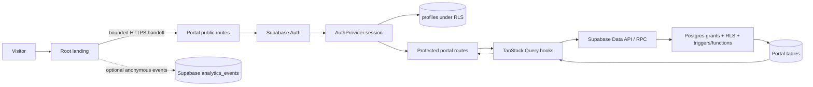
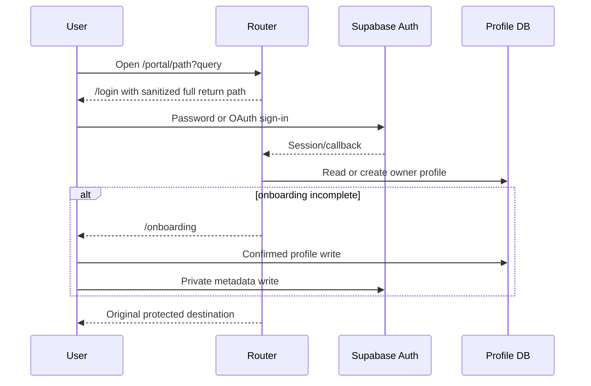

# FinanceMeta website architecture

Historical baseline: 2026-09-20. The 2026-09-21 transformation report, CONTENT_OPERATIONS.md and native intake documentation supersede the public route inventory and typecheck descriptions below.

## Repository topology

| Path | Responsibility | Runtime/deployment |
| --- | --- | --- |
| `/` | Focused public landing, CTA handoff and bounded anonymous analytics | React 18, Vite 8, TypeScript 7; separate Vercel project |
| `/Finance4allLanding` | Public learning/evidence, Auth, onboarding and member portal | React 18, Vite 8, TypeScript 5.8, React Router 7, Supabase, TanStack Query; canonical portal Vercel project |
| `/FinanceMetaLanding` | Research/evidence registry and reports | No audited browser runtime |
| `/.github/workflows/release-check.yml` | Combined root/portal release verification | GitHub Actions, Ubuntu 24.04, Node 22.23.2 |
| `/Finance4allLanding/.github/workflows` | Portal CI, production health, migration ledger, RLS and credentialed auth certification | GitHub Actions |

The workspace root is not itself a Git checkout in this environment. `Finance4allLanding/` is a Git repository on `main`; release provenance is enforced there.

## Runtime boundaries

### Root landing

- Entry: `src/main.tsx`.
- Styling: `src/index.css`.
- Conversion contract: `src/cta-inventory.ts`, `src/member-handoff.ts`.
- Analytics: `src/analytics.ts` writes allowlisted, anonymous events directly to Supabase REST when configured. Failure is intentionally non-blocking.
- Environment: `VITE_MEMBER_APP_URL`, optional `VITE_SUPABASE_URL`, optional `VITE_SUPABASE_PUBLISHABLE_KEY`.
- Build/deploy: root `package.json`, `vercel.json`.

### Member application

- Entry/provider graph: `src/main.tsx` → `src/App.tsx` → Theme, Query, tooltip/toast and error-boundary providers → `src/components/AppRouter.tsx`.
- Router: React Router browser routes with lazy member pages.
- Auth: `src/contexts/AuthContext.tsx`, Supabase Auth, local persistent session and 15-second operation deadlines.
- Data: typed Supabase browser client in `src/lib/supabase.ts`; table/RPC access in `src/hooks/portal/`.
- Authorization: PostgreSQL grants, RLS, immutable ownership triggers and security-definer functions in `supabase/migrations/`.
- Caching: TanStack Query, one-minute default `staleTime`, one retry; auth-account changes clear the query cache.
- Content: public local content in `src/content/` and `src/data/`; database content may replace or augment it in hooks.
- Build/deploy: `package.json`, `vite.config.ts`, `vercel.json`, immutable `/release-revision.json` generated only from clean source.

There are no Next.js server components, server actions, custom API routes, queues, background jobs or application servers. The browser talks to Supabase Auth, PostgREST and permitted RPCs. That makes database authorization the critical server boundary.

## Route inventory

### Public

| Route | Purpose | Data |
| --- | --- | --- |
| `/` | Long-form Finance for All entry, programs, research, map, membership and contact | Local catalog/content |
| `/evidence` | Research/evidence boundary | Local/canonical source links |
| `/learn` | Public learning directory | Local editorial content |
| `/learn/five-foundations` | Standalone foundational lesson | Local lesson |
| `/learn/debriefs` | Public debrief list | Local editorial fallback/content |
| `/learn/debriefs/:slug` | Public debrief detail | Local editorial content |
| `/login`, `/signup` | Supabase provider entry | Public Auth settings + Supabase Auth |
| `/forgot-password`, `/reset-password` | Recovery | Supabase Auth |
| `/auth/callback` | OAuth/email callback and error handling | Supabase session + sessionStorage return path |

### Protected

| Route | Purpose | Principal data |
| --- | --- | --- |
| `/onboarding` | Public profile + private member metadata setup | `profiles`, Auth metadata, chapters |
| `/portal` | Personalized dashboard/activity | Profile and member activity tables |
| `/portal/debriefed*` | News, explainers, preferences, saved items | articles, explainers, preferences, bookmarks/Auth metadata |
| `/portal/labs*` | Research catalog, project/application flows | research projects, applications |
| `/portal/labs/review` | Lead/admin review | role-gated applications/projects |
| `/portal/pathways*` | Opportunities, interests, studios and essays | opportunities, interests, submissions, upvotes |
| `/portal/events` | Chapters, events and registration | chapters, events, registrations |
| `/portal/network*` | Directory, connections and introductions | profiles, requests, posts |
| `/portal/saved` | Saved work | bookmarks and Auth metadata |
| `/portal/settings` | Profile, preferences, export and deletion | profiles, Auth metadata, lifecycle RPCs |
| `/portal/admin` | Content and deletion-review administration | role-protected content and requests |

## Major data flows

### Auth and return-path state

Only paths beginning `/portal` survive sanitization. Protocol-relative, cross-origin and public-route redirects fall back to `/portal`.

## Database and authorization

The source contains timestamped migrations from the initial schema through trusted profile-role administration. Canonical public data includes profiles, chapters, editorial content, research, applications, opportunities, submissions, events, connections, introductions, bookmarks, notifications, learning progress and account deletion requests.

Security layers:

1. Browser receives a publishable key only.
2. Schema/table/column/function grants restrict which operations PostgREST exposes.
3. RLS binds rows to `auth.uid()` or trusted role helpers.
4. Triggers protect ownership and role fields.
5. Security-definer functions use pinned search paths and revoke broad execution.
6. Client RoleGuard hides inappropriate routes but is not relied on for security.
7. Release and production workflows compare the canonical project, migration ledger and exact SHA.

The current audit replayed migrations on `public.ecr.aws/supabase/postgres:17.6.1.165`, then passed both SQL certification scripts. Production equivalence is a separate required gate.

## Client/server and trust boundaries

| Boundary | Trusted control | Untrusted input |
| --- | --- | --- |
| Landing handoff | HTTPS/member-origin validator | URL query attribution and configured destination |
| Auth redirect | Canonical-origin assertion + path sanitization | Router state, OAuth callback query/fragment |
| Profile/member operations | JWT, grants, RLS, owner predicates | Form content, IDs, direct client requests |
| Admin/lead operations | DB roles and policies | Client RoleGuard and all browser claims |
| Markdown/links | React escaping + URL normalizer | Database/local markdown and external URLs |
| Public metrics/content | Visible evidence/status qualifiers | Organization-supplied claims and program descriptions |
| Deployment identity | Clean-tree release revision | Mutable local working tree or provider state |

## Caching and synchronization

- TanStack Query uses a 60-second default stale time and one retry.
- Mutations invalidate the relevant query keys.
- Auth account changes clear all query cache state.
- Stale in-flight profile results are ignored with generation/user checks.
- Hashed `/assets/*` receive one-year immutable caching from Vercel.
- HTML uses provider revalidation; release health sends `cache-control: no-cache`.
- Saved editorial slugs in Auth metadata are not transactional across tabs.

## Integrations

| Service | Use | Status |
| --- | --- | --- |
| Supabase Auth | Email/password, Google, recovery, session metadata | Implemented; live journeys unverified in this audit |
| Supabase Postgres/PostgREST | Portal storage and authorization | Local replay verified; production ledger/RLS unverified |
| Vercel | Two independent static SPA deployments | Portal health verified at clean HEAD; root landing stale |
| Tally | External applications/chapter intake | Links present; external form behavior not audited |
| GitHub | Research source links | Public links present where repositories are public |
| Email client | `mailto:` contact/submission | Present; delivery and response operations unverified |

No payments, transactional email provider, AI inference, queue, file upload flow, cron/background job, feature-flag service or error-reporting vendor is present.

## Security headers

Both Vercel configurations specify CSP, frame denial, MIME sniffing denial, strict referrer policy and camera/microphone/geolocation denial. The portal CSP pins the canonical Supabase HTTPS and WebSocket origins. Live portal health additionally verifies HSTS. The root source CSP still allows any `*.supabase.co` connect origin; narrow it after the analytics target is final.

## Build, test and release architecture

- Root `release:check`: source marker scan → accessibility-source contract → CTA/funnel contract → typecheck/build → output/metadata check.
- Portal `npm test`: release-toolchain tests → 119 Vitest tests → 27 Node release/security contract tests.
- Portal CI: locked install/audit, typecheck, tests, lint, production build, browser tests and database authorization job.
- Database CI: disposable Supabase PostgreSQL image → bootstrap → all migrations → two-identity RLS → account lifecycle RLS.
- Release revision: production build must have a clean tracked/untracked state and immutable SHA.
- Production health: verifies service/revision JSON, critical routes and response headers.

## Known architectural debt

1. Two separately deployed public landing experiences duplicate content and brand ownership.
2. AuthProvider wraps anonymous routes and pulls Supabase/Auth into the public entry graph.
3. Browser data hooks are the only application service layer; mutation-confirmation behavior is inconsistent.
4. Demo-data suppression lives in UI hooks rather than publication state.
5. Auth metadata stores onboarding and saved-guide state that would be safer and more queryable in owner-scoped tables.
6. No central telemetry or correlation layer exists.
7. Static HTML metadata cannot vary by public guide route.
8. Privacy/consent/retention policy is not represented in routes or database records.
